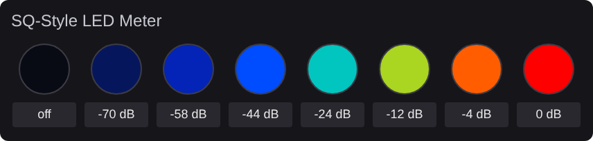

# qsys-gradientmeter: SQ-Style LED Meter (Q-SYS plugin)

One LED per channel whose color follows the audio level: dark when there is no
signal, then blue, through green and yellow, to red at the top of the range.
It's modelled on the signal LEDs of an Allen & Heath SQ console and built for
Q-SYS Designer 10.x.



## Install

1. Copy `SQ-Style LED Meter.qplug` to `Documents\QSC\Q-Sys Designer\Plugins\`.
2. Restart Designer. The plugin is under **Schematic Library → Plugins → Meters**.
3. Drag it into the schematic and set its properties:

| Property | Options |
|---|---|
| Channels | 1–64 LEDs |
| Color Scheme | Blue to Red (SQ), Blue to Red (no green), Green to Red (Classic) |
| LED Shape | Round or Square |
| LED Size | 12–128 px |
| Off Below (dB) | Default −48. Below this the LED is off; at it, deep blue |
| Full Red At (dB) | Default 0. At and above this the LED is solid red |
| Release (dB/s) | Default 20. How fast the color falls back after a peak (rise is instant) |
| Diagnostics | Off, Log (prints each channel's level and color once a second), or Color Sweep (cycles every LED through the gradient, ignoring the input) |

## Feeding it audio levels

Each channel can take its level in either of two ways.

**A. Wire a pin (simplest).** On any meter (Meter, Gain, Mixer, etc.), enable
the meter's output control pin and wire it to the plugin's **Level In** pin
for that channel.

**B. Point it at a named component.** On the plugin's **Setup** page, enter
the component's **Code Name** and the control name (for example `meter.1`).
The source component must have **Script Access** set to `Script` or `All`.
A channel with a component set ignores its pin. If a name can't be found,
the **Status** control turns red and says which channel is wrong.

To list a component's control names, run this in any Text Controller:

```lua
for _, c in ipairs(Component.GetControls(Component.New("MyMeter"))) do print(c.Name) end
```

## Putting it on a UCI

Open the plugin's **LEDs** page and copy the LEDs (and names, if you want them)
onto your UCI page. The script sets each LED's color live, so it looks the same
in any UCI theme. When the design starts, the debug output prints the range and
release in use.

## Development

The tests load the plugin into a mocked Q-SYS Lua environment and check the
layout and the color behavior:

```sh
pip install lupa pytest
python3 -m pytest test
python3 tools/preview.py docs/preview.svg   # render the LEDs page
```

To change the colors, edit the `SCHEMES` table near the top of the `.qplug`.
If you do, also bump `BuildVersion` in `PluginInfo` so Designer picks up the change.
